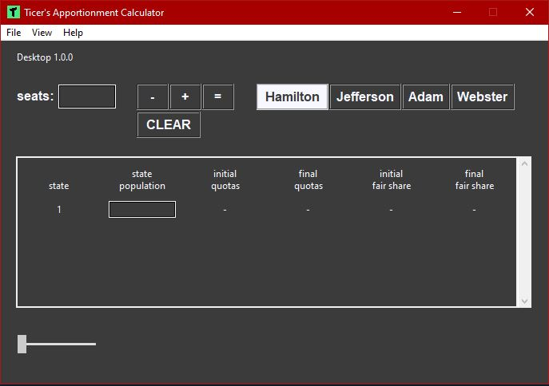
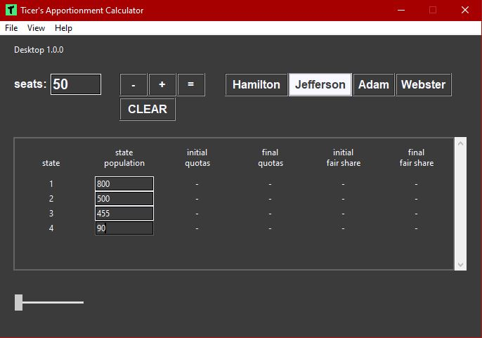
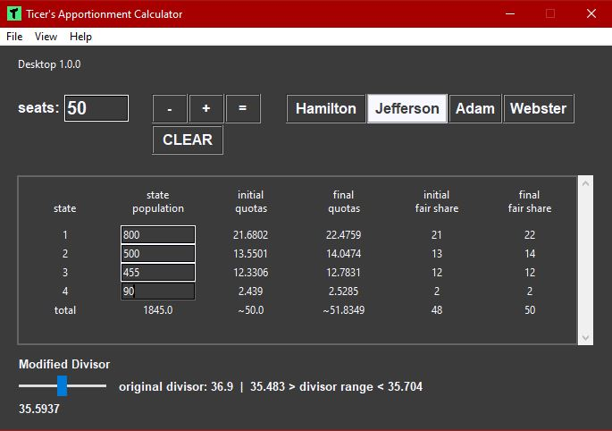
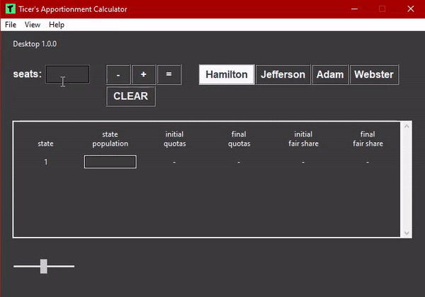
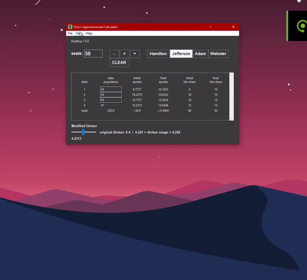

# Apportionment Calculator
### Calculate quotas, fair-shares, and divisors for Jefferson's, Adam's, Webster's, and Hamilton's methods.

Dessktop icon (1.0.1)

# Mobile App Implementation:
Android (free with ads): <a href="https://play.google.com/store/apps/details?id=com.brandon.apportionmentcalculator&hl=en_US&gl=US">View</a> on Play Store

Android (99c without ads): <a href="https://play.google.com/store/apps/details?id=com.brandon.apportionmentcalculatorpro&hl=en_US&gl=US">View</a> on Play Store

# Website
For more information visit the apps page of my website https://ticerapps.com/apps

# Desktop version

  
Expand documentation

   
  

    
GUI

    
      Scripts responsible for building the GUI
    
      apportionment_calculator.py
    
      class - App
        function - save_recent_data - saves previous calculation, when app is closed previous data loads in the table 
        function - load_saved_table_data - loads saved (or recent) data into the table
        function - save_csv - saves/exports a csv file containing data in the table
        function - save_xlsx - saves/exports an xlsx file containing data in the table
        function - change_method_hamilton - changes apportionment method to hamilton
        function - change_method_jefferson - changes apportionment method to jefferson
        function - change_method_adam - changes apportionment method to adam
        function - change_method_webster - changes apportionment method to webster
        function - add_state - adds a new row to the table with six columns
        function - remove_state - removes a row from the table
        function - clear_states - clears data from the table 
        function - calculate - calculates quotas, fair shares, and divisors and displays results in table
        function - show_about - shows a popup with information about this software
        function - show_guide - shows a popup with instructions on how to use the software
        function - slider_changed - updates divisor and table values when the slider widget is used
        function - change_theme_dark - changes app theme to dark mode
        function - change_theme_light - changes app theme to light mode
        function - change_theme_clt_green - changes app theme to unc charlotte school colors
        function - change_theme_tarheel_blue - changes app theme to unc chapel hill school colors
        function - change_theme_wolfpack_red - changes app theme to nc state school colors
  
    
      main_plots.py
    
      class - Plot
        function - create_combined_graph - creates a single popup containg divisor algorithm graph and fair share chart
        function - create_divisor_graph - creates a popup graph displaying how the algorithm calculates an acceptable divisor 
                                          as well as the lowest and highest possible estimated divisors
        function - create_fair_share_plot - creates a popup chart displaying the fair share allocations to each state
        function - calculate_plot_points - creates lists for estimations, lowest, and highest possible estimated divisors

  

  
  

    
Methods

    
      API
    
      class - Hamilton
        parameters 
          - num_seats: int - number of seats to apportion
          - states: int - number of states to apportion seats to
          - populations: [float] * states - list of populations per state (list must be same size as number of states)
        functions
          - calculate_quotas([0] * states) - calculates the original quotas for each state and initializes a list for 
                                             final quotas
          - calculate_fair_shares([0] * states, quotas) - calculates final fair shares and final quotas
          - calculate - apportions seats to states, uses calculate_quotas and calculate_fair_shares
        Usage
          method = Hamilton(num_seats, states, populations)
          results = method.calculate() -> returns original divisor, modified divisor, original quotas, final quotas, 
                                          initial fair shares, final fair shares, sum of inititial fair shares, 0, 0, 0
    
      class - Jefferson
        parameters 
          - num_seats: int - number of seats to apportion
          - states: int - number of states to apportion seats to
          - populations: [float] * states - list of populations per state (list must be same size as number of states)
        functions
          - calculate_quotas([0] * states) - calculates the original quotas for each state and initializes a list for 
                                             final quotas
          - calculate_fair_shares([0] * states, quotas) - calculates final fair shares and final quotas
          - calculate - apportions seats to states, uses calculate_quotas and calculate_fair_shares
          - calculate_with_divisor(float: divisor) - calculates results given a divisor as a parameter
          - calculate_lower_boundary(float: divisor) - calculates lowest estimated possible divisor that can be used
          - calculate_upper_boundary(float: divisor) - calculates highest estimated possible divisor that can be used
          - calculate_plot_points(lower_divisor, upper_divisor) - creates lists of divisors and estimations
        Usage
          method = Jefferson(num_seats, states, populations)
          results = method.calculate() -> returns original divisor, modified divisor, original quotas, final quotas, 
                                          initial fair shares, final fair shares, sum of inititial fair shares, 
                                          lower boundary, upper boundary, estimation history
        
    
      
  

  

 

Release design (1.0.0)

Enter a number of seats to apportion, add some states and enter their populations, and select a method to use to apportion the seats.

Press = to calculate results.

You can use the slider at the bottom to change the divisor to any value that will result in the proper distributions

You can also display a graph that shows all the estimated divisors guessed until a proper divisor is found and a bar graph showing the fair shares.

# Downloads

| 1.1.2 (latest) | 1.1.1 | 1.1.0 | 
|-------|-------|-------|
| <a href="https://github.com/btror/apportionmentCalculatorPy/releases/download/1.1.2/apportionmentCalculatorPy.exe">Download exe</a> | <a href="https://github.com/btror/apportionmentCalculatorPy/releases/download/1.1.1/Apportionment.Calculator.exe">Download exe</a> | <a href="https://github.com/btror/apportionmentCalculatorPy/releases/download/1.1.0/apportionmentCalculatorPy.exe">Download exe</a> |
| <a href="https://github.com/btror/apportionmentCalculatorPy/archive/refs/tags/1.1.2.zip">Download zip</a> | <a href="https://github.com/btror/apportionmentCalculatorPy/archive/refs/tags/1.1.1.zip">Download zip</a> | <a href="https://github.com/btror/apportionmentCalculatorPy/archive/refs/tags/1.1.0.zip">Download zip</a>

| 1.0.1 | 1.0.0 |
|-------|-------|
| <a href="https://github.com/btror/apportionmentCalculatorPy/releases/download/1.0.1/apportionmentCalculatorPy.exe">Download exe</a> | <a href="https://github.com/btror/apportionmentCalculatorPy/releases/download/1.0.0/apportionmentCalculatorPy.exe">Download exe</a> |
| <a href="https://github.com/btror/apportionmentCalculatorPy/archive/refs/tags/1.0.1.zip">Download zip</a> | <a href="https://github.com/btror/apportionmentCalculatorPy/archive/refs/tags/1.0.0.zip">Download zip</a> |

