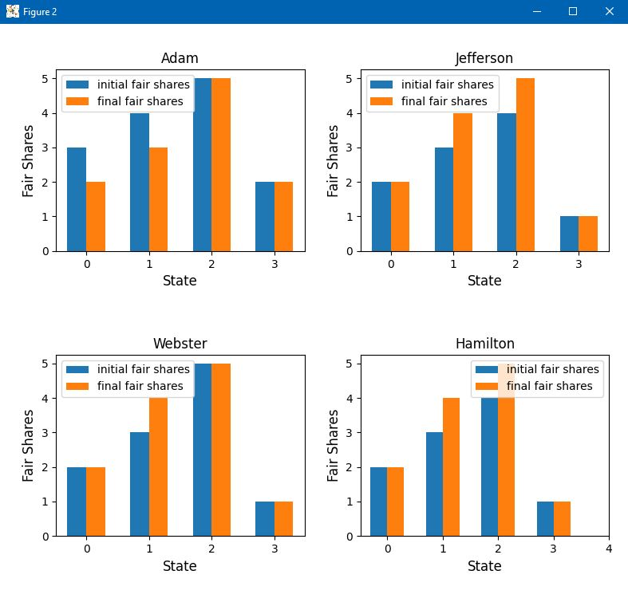
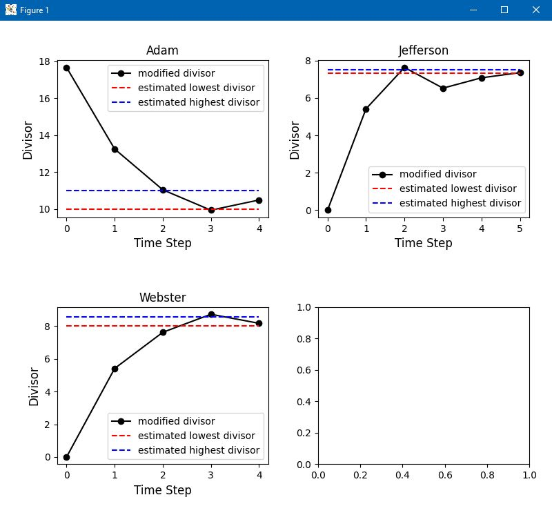
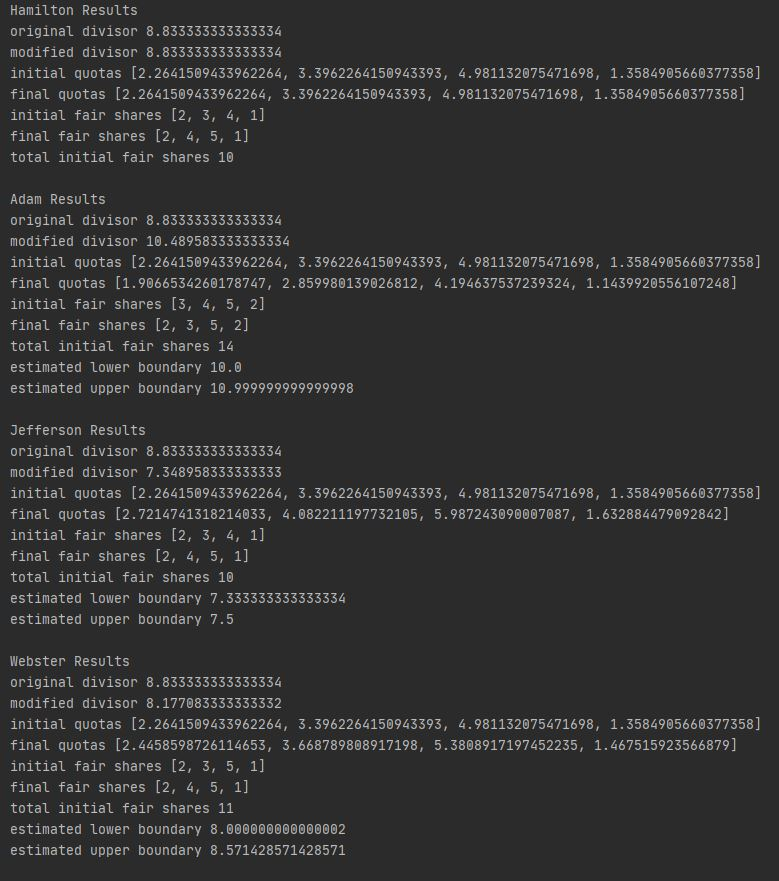

# Apportionment Calculator
### Calculating quotas, fair-shares, and divisors for Jefferson's, Adam's, Webster's, and Hamilton's methods.

Bar graph shows the initial and final fair share of seats for each state (state 1 is 0, state 2 is 1, etc...)

Line graph shows the number of times the algorithms recalculates the divisor to get closer to an acceptable value (within the red and blue bounds) resulting in the proper amount of seats being distributed to each state.

Detailed output is provided displaying the initially calculated fair shares, quotas, final quotas, final fair shares, initial divisor, final divisor (first acceptable one calculated), highest estimated acceptable divisor, lowest estimated acceptable divisor, etc...

