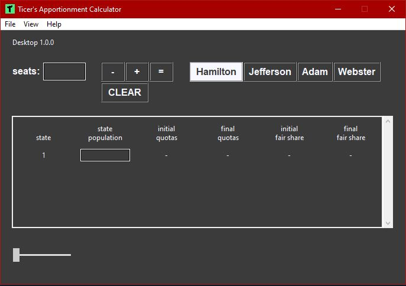
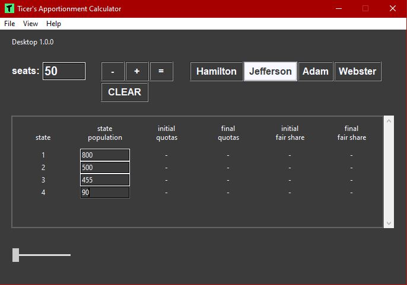
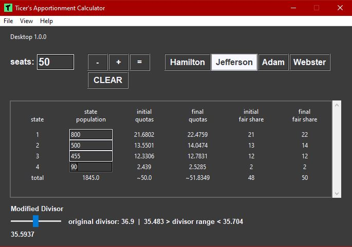
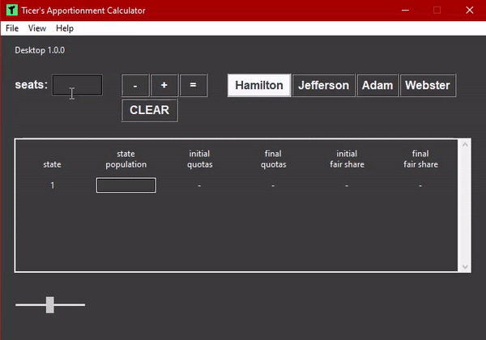
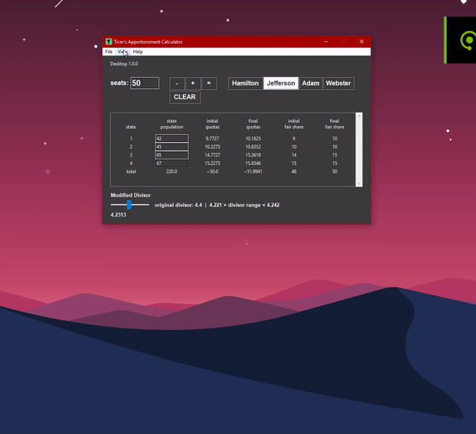

# Apportionment Calculator
### Calculate quotas, fair-shares, and divisors for Jefferson's, Adam's, Webster's, and Hamilton's methods.

Release design

Enter a number of seats to apportion, add some states and enter their populations, and select a method to use to apportion the seats.

Press = to calculate results.

You can use the slider at the bottom to change the divisor to any value that will result in the proper distributions

You can also display a graph that shows all the estimated divisors guessed until a proper divisor is found and a bar graph showing the fair shares.

# Mobile App Implementation:
Android (free with ads): https://play.google.com/store/apps/details?id=com.brandon.apportionmentcalculator&hl=en_US&gl=US

Android (pro no ads): https://play.google.com/store/apps/details?id=com.brandon.apportionmentcalculatorpro&hl=en_US&gl=US

# Website
For more information visit the apps page of my website https://ticerapps.com

# Download
<a href="https://github.com/btror/apportionmentCalculatorPy/releases/download/1.0.0/apportionmentCalculatorPy.exe">apportionmentCalculatorPy.exe</a>
<a href="https://github.com/btror/apportionmentCalculatorPy/releases/download/1.0.0/apportionmentCalculatorPy.zip">apportionmentCalculatorPy.zip</a>
